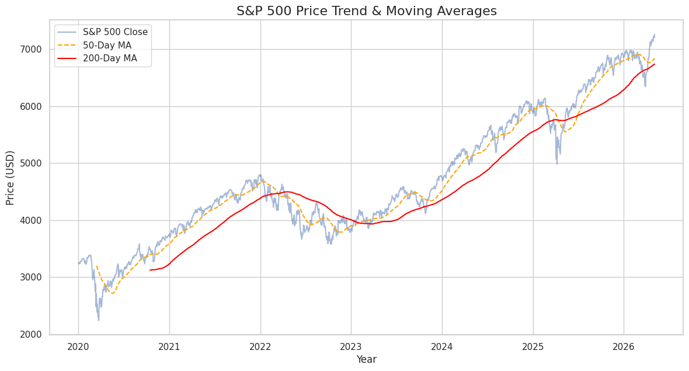
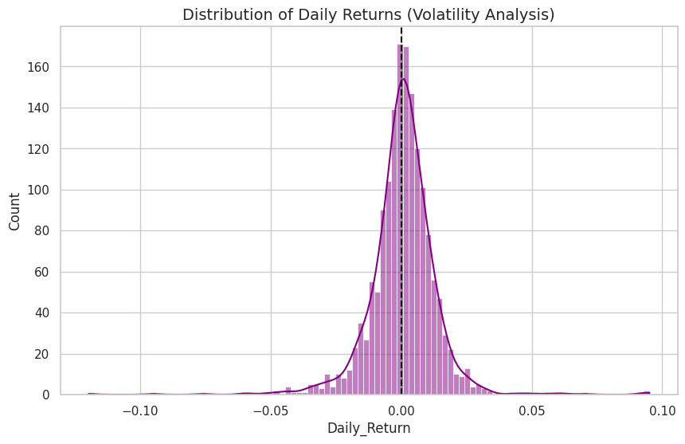
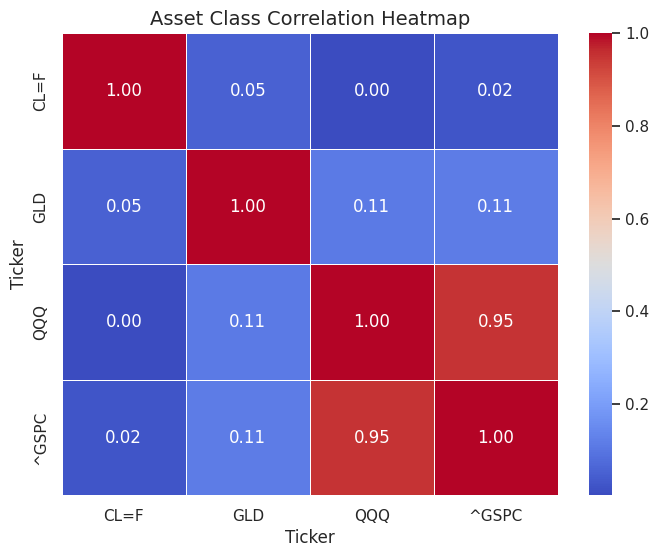

## S&P 500 Market Trend & Risk Analysis

### **Project Overview**
This repository contains a comprehensive technical analysis of the S&P 500 (Standard & Poor's 500 Index). The goal of this project is to leverage Python's data science ecosystem to extract, clean, and visualize historical market data, providing insights into momentum, volatility, and asset correlations.

This project demonstrates the application of quantitative finance principles through programmatic data analysis, bridging the gap between financial reporting and data science.

### **Key Features**
*   **Live Data Integration:** Utilizes the Yahoo Finance API (`yfinance`) to fetch real-time and historical market data.
*   **Momentum Indicators:** Calculation and visualization of 50-day and 200-day Simple Moving Averages (SMA) to identify market trends and "Golden Cross" or "Death Cross" events.
*   **Risk Metrics:** Statistical analysis of daily returns and rolling 30-day volatility to assess market stability.
*   **Multi-Asset Correlation:** A comparative heatmap analyzing the S&P 500's relationship with Tech (QQQ), Gold (GLD), and Crude Oil (CL=F).

### **Technical Stack**
*   **Language:** Python 3.x
*   **Data Manipulation:** Pandas, NumPy
*   **Visualization:** Seaborn, Matplotlib
*   **Data Source:** yfinance (Yahoo Finance API)





### **Installation & Usage**

**1. Clone the repository**
```bash
git clone https://github.com/thesjhu/sp500-analysis.git
cd sp500-analysis
```

**2. Install dependencies**
```bash
pip install pandas numpy matplotlib seaborn yfinance
```

**3. Run the analysis**
Open the Jupyter Notebook (`sp500_analysis.ipynb`) in your preferred IDE (VS Code, JupyterLab, etc.) and execute the cells sequentially.

### **Analytic Methodology**

#### **1. Trend Identification**
By plotting the closing prices against the 50-day and 200-day moving averages, the analysis identifies whether the index is in a bullish or bearish phase. This is a critical metric for institutional sentiment analysis.

#### **2. Volatility Distribution**
Using Seaborn’s Kernel Density Estimate (KDE) plots, the project visualizes the distribution of daily returns. This helps in understanding the "Fat Tail" risks and the frequency of extreme market moves.

#### **3. Sector Correlation**
The correlation matrix provides insight into diversification. By analyzing how the S&P 500 moves in relation to commodities and specialized tech sectors, the notebook helps identify hedging opportunities.

### **Author**
**Sijie Hu**  
MS in Information Systems, Data Analytics | Baruch College
